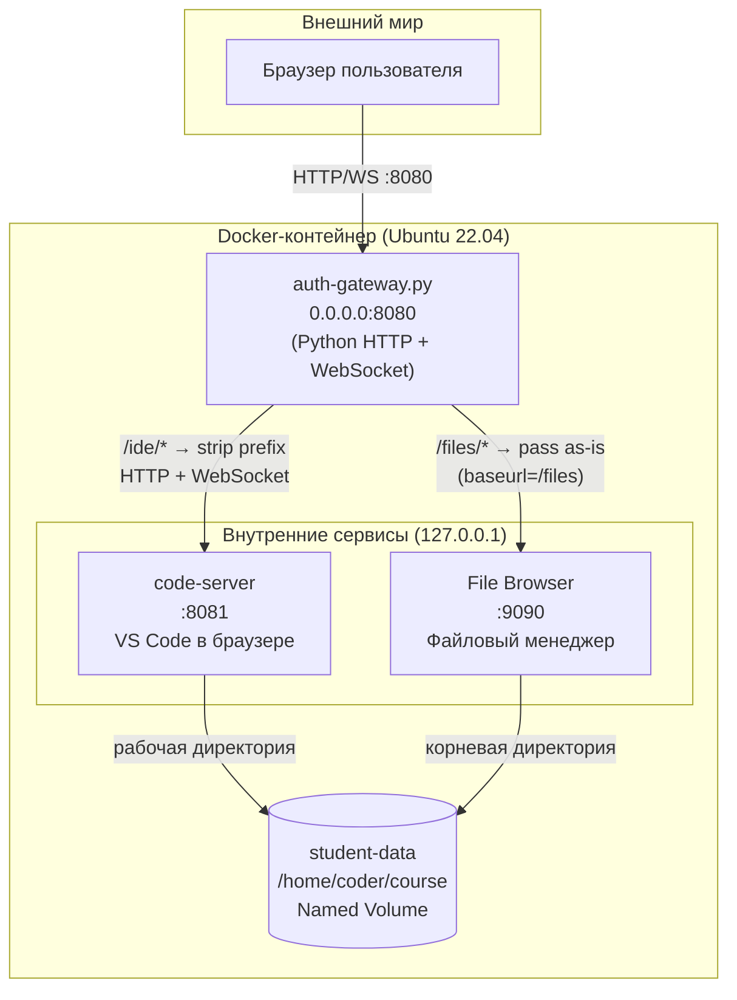
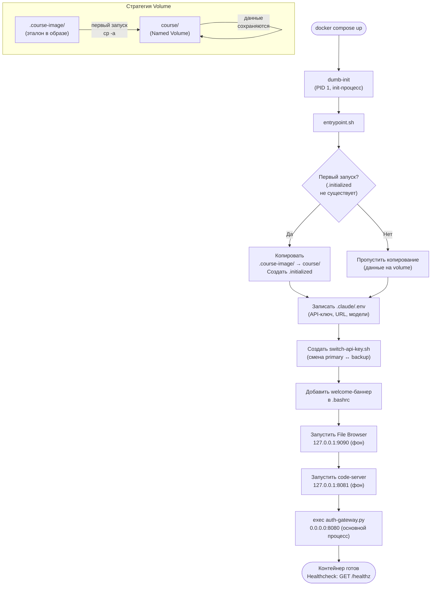
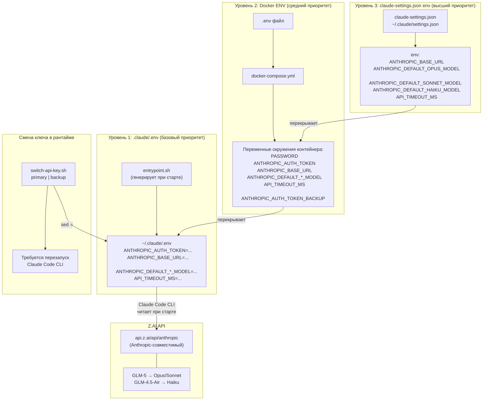

# Архитектурные диаграммы

Визуальное описание ключевых архитектурных решений проекта. Каждая диаграмма сопровождается пояснением для контрибьюторов.

## Содержание

- [Архитектура контейнера](#архитектура-контейнера)
- [Жизненный цикл контейнера](#жизненный-цикл-контейнера)
- [Поток аутентификации](#поток-аутентификации)
- [Конфигурация API-провайдера](#конфигурация-api-провайдера)

---

## Архитектура контейнера

Контейнер реализует паттерн **single entry point**: единственный открытый порт `:8080` принимает весь трафик, а внутренние сервисы слушают только на `127.0.0.1`.



**Ключевые решения:**

- **Один открытый порт** `:8080` упрощает деплой и firewall-правила
- **code-server** получает путь без префикса (`/ide/terminal` → `/terminal`), потому что не поддерживает `baseurl`
- **File Browser** получает путь целиком (`/files/api/resources`), потому что настроен с `--baseurl /files`
- **Named volume** `student-data` сохраняет работу студента между перезапусками контейнера
- **WebSocket** проксируется через raw socket relay для терминала и LSP в code-server

---

## Жизненный цикл контейнера

Процесс инициализации от `docker compose up` до готовности сервисов.



**Ключевые решения:**

- **dumb-init** как PID 1 корректно обрабатывает сигналы и reap zombie-процессов
- **exec** для auth-gateway заменяет shell-процесс, чтобы Python получал сигналы напрямую
- **Двойное копирование** курса (`.course-image` + `course/` в Dockerfile) позволяет контейнеру работать и без volume (для быстрого теста), и с volume (для persistence)
- **`.initialized` маркер** предотвращает повторное копирование при рестарте

---

## Поток аутентификации

Как `auth-gateway.py` управляет сессиями: от ввода пароля до проксирования запросов.

```mermaid
sequenceDiagram
    participant Б as Браузер
    participant GW as auth-gateway.py<br/>:8080
    participant CS as code-server<br/>:8081
    participant FB as File Browser<br/>:9090

    Note over GW: SECRET = HMAC-SHA256("claude-course-gateway", PASSWORD)
    Note over GW: TOKEN = HMAC-SHA256(SECRET, "authenticated")

    Б->>GW: GET /
    GW->>GW: Cookie cc_session отсутствует
    GW-->>Б: 200 login.html

    Б->>GW: POST /login (password=...)
    alt Пароль верный
        GW-->>Б: 302 → /ide/<br/>Set-Cookie: cc_session=TOKEN;<br/>HttpOnly; SameSite=Lax
    else Пароль неверный
        GW-->>Б: 200 login.html + "Неверный пароль"
    end

    Б->>GW: GET /ide/terminal
    GW->>GW: Проверить cc_session cookie<br/>hmac.compare_digest(cookie, TOKEN)
    GW->>CS: GET /terminal<br/>(prefix /ide/ удалён)
    CS-->>GW: 200 HTML
    GW-->>Б: 200 HTML

    Б->>GW: GET /files/api/resources
    GW->>GW: Проверить cc_session cookie
    GW->>FB: GET /files/api/resources<br/>(путь без изменений)
    FB-->>GW: 200 JSON
    GW-->>Б: 200 JSON

    Б->>GW: WS Upgrade /ide/...
    GW->>GW: Проверить cc_session cookie
    GW->>CS: Raw socket connection
    Note over Б,CS: Двунаправленный relay<br/>(select + 64KB буфер, таймаут 30с)

    Б->>GW: GET /logout
    GW-->>Б: 302 → /<br/>Set-Cookie: cc_session=; Max-Age=0
```

**Ключевые решения:**

- **Двойной HMAC**: SECRET выводится из пароля, TOKEN выводится из SECRET. Знание TOKEN не раскрывает пароль
- **HttpOnly + SameSite=Lax**: cookie недоступен JavaScript (защита от XSS) и не отправляется в cross-site POST (защита от CSRF)
- **Сессионная cookie** (без Max-Age): истекает при закрытии браузера
- **Без пароля** (`PASSWORD=""`): шлюз пропускает все запросы без проверки
- **Hop-by-hop заголовки** (`connection`, `transfer-encoding` и т.д.) удаляются при проксировании
- **WebSocket** проксируется через raw socket relay, а не через HTTP-апгрейд на бэкенде

---

## Конфигурация API-провайдера

Claude Code внутри контейнера использует три уровня конфигурации. Каждый следующий уровень перекрывает предыдущий.



**Как работает приоритет:**

1. **`.claude/.env`** — генерируется `entrypoint.sh` из переменных окружения контейнера. Claude Code CLI читает этот файл при запуске. Содержит API-ключ, URL и модели
2. **Docker ENV** — переменные из `docker-compose.yml` и `.env` файла. Попадают в контейнер и используются `entrypoint.sh` для генерации `.claude/.env`
3. **`claude-settings.json` → `env`** — секция `env` в файле настроек Claude Code. Имеет высший приоритет и перезаписывает одноимённые переменные окружения

**Смена API-ключа в рантайме:**

- `./switch-api-key.sh backup` — переключает на резервный ключ (для обхода rate limit)
- `./switch-api-key.sh primary` — возвращает основной ключ
- Скрипт модифицирует `.claude/.env` через `sed`, требуется перезапуск Claude Code CLI
